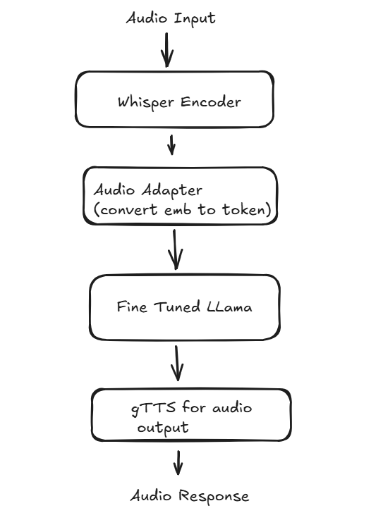
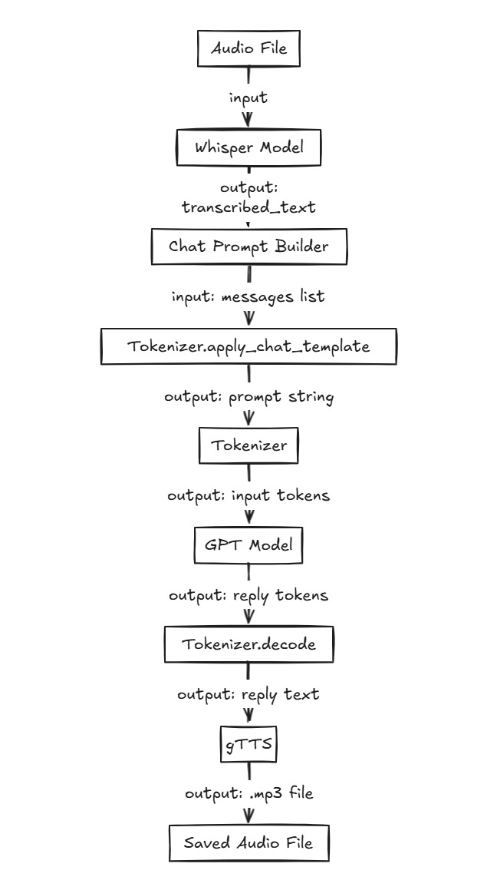

# Speech2Speech AI Model

This repository presents multiple methods to train your own **Speech-to-Speech (S2S)** model. 

---

## 🔧 Model Fine-Tuning with Unsloth

We fine-tuned the LLaMA model using [Unsloth](https://github.com/unslothai/unsloth) for efficiency and stability.

### Why we used Unsloth:

* ✅ **Optimized for speed**: It significantly reduces training time.
* ✅ **Memory efficient**: Supports longer sequences and larger batch sizes on limited hardware.
* ✅ **Seamless integration** with Hugging Face and LLaMA models.
* ✅ **Low-Rank Adaptation (LoRA)** support for faster fine-tuning with fewer parameters.

---

## 🧪 Experiments & Hypotheses

We explored three different hypotheses to build the speech-to-speech pipeline:

---

### **Method 1: Whisper → Audio Encoder → LLaMA → gTTS**

* **Pipeline**:
  Whisper → Audio Encoder (Embeddings → Tokens) → Fine-tuned LLaMA → gTTS

* **Goal**: Convert audio to embeddings, translate via LLaMA, and convert back to audio.

* **Problem**:
  This method failed due to **token mismatch** between the encoder output and the LLaMA tokenizer. The token IDs predicted by the audio encoder did not align with the vocabulary space of the LLaMA model, resulting in meaningless or out-of-distribution outputs.

---

### **Method 2: Whisper → Audio Encoder (Emb → LLaMA Emb) → Nearest Token → LLaMA → gTTS**

* **Pipeline**:
  Whisper → Audio Encoder (maps to LLaMA embedding space) → Nearest Token Matching → LLaMA → gTTS

* **Outcome**:
  ✅ This method **worked successfully**. The audio encoder learned to generate embeddings compatible with LLaMA's token space. By mapping them to the nearest valid token before feeding into the fine-tuned LLaMA, we achieved coherent outputs.

* **Diagram**:




---

### **Method 3: Whisper → Text → LLaMA → Text → gTTS**

* **Pipeline**:
  Whisper (Speech → Text) → LLaMA → Text → gTTS (Text → Speech)

* **Description**:
  This is a more straightforward pipeline using Whisper for transcription and gTTS for synthesis, with the LLaMA model providing intermediate natural language transformation.

* **Diagram**:

## 📂 Project Structure

```
├── fine_tune_with_unsloth/          
├── output_audio_files/         
├── sample_input_audio_file/               
├── Image1.png                 
├── Image2.jpg                
├── VB_m2_final.ipynb        
├── VB_m3_final.ipynb        
└── requirements.txt         
```

---

## 📌 Requirements

Install the dependencies using:

```bash
pip install -r requirements.txt
```

---

